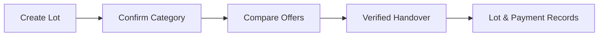

# E-CHAKRA

E-CHAKRA is a proposed platform connecting informal e-waste collectors with authorised recyclers and helping route reusable electronics to repair shops.

**Smart India Hackathon 2026 — Problem Statement 229:** *Kabadiwala Connect — Bringing the Informal Collector into the Formal Recycling Chain.*

## Problem and proposed solution

Informal collectors provide a local collection route for discarded electronics, but participation in the formal recycling chain can be difficult when price information, suitable buyers and handover records are unavailable or hard to access. Language, literacy and intermittent internet access also shape how a useful collection platform should work.

E-CHAKRA proposes a shared digital process for recording material lots, reviewing prices and offers, finding suitable authorised recyclers, and documenting handovers and payments. Reusable electronics would be directed towards participating repair shops where appropriate. The aim is to make each transaction easier to understand and trace while supporting collectors' existing working practices.

## Intended users

- **Informal collectors:** kabadiwalas, waste-pickers and other local collectors recording and selling their lots.
- **Aggregators:** participants combining multiple lots while retaining each collector's contribution and payment records.
- **Authorised recyclers:** buyers reviewing available material, providing offers and confirming receipt.
- **Repair shops:** participants assessing reusable or repairable electronics for an appropriate reuse route.

## Essential planned features

- **Lot capture:** photographs, collector-confirmed material categories and approximate weight entry. Initial categories are CRTs, LCD panels, PCBs, cables, motors, batteries, magnet-bearing assemblies and mixed plastics.
- **Price visibility:** historical price information, clearly labelled estimates and comparison of buyer offers. Final sale amounts would be recorded separately.
- **Recycler matching:** suggestions based on material suitability, location and recycler information, with authorisation details checked before participation.
- **Documented handovers:** unique references linking lots, participants, confirmed quantities and handover acknowledgements.
- **Payment records:** cash payments and optional digital payments, with amounts, status and available confirmation recorded against the transaction.
- **Accessible participation:** Hindi and Marathi interfaces, pictorial navigation, and audio/video safety guidance.
- **Offline use and incentives:** local lot capture followed by synchronization when connected; referral rewards and incentives for qualifying verified deliveries, with eligibility rules still to be defined.
- **Aggregator accounting:** combined lots linked back to source lots, preserving individual collectors' quantities and payment records.

## Planned collector workflow

Lot capture and manual category confirmation are intended to work offline. Live offers and cloud ML results require connectivity. Handover verification would depend on participant confirmation and supporting records; creating a lot alone would not mark it as delivered or paid.

## Current project status

E-CHAKRA is under development at the documentation and planning stage. This repository currently contains project documentation only; the features above are planned, with no application implementation or validated model performance demonstrated here.

ML is limited to **material classification, price estimation/prediction and authorised recycler matching**. Audio/video guidance and language support do not introduce ML-based speech recognition or voice translation. PostgreSQL is planned for structured central data. A separate local database is planned for offline use; its technology remains unselected.

## Further documentation

- [Proposed system architecture](docs/system-architecture.md): logical components, offline capture and connected services.
- [Data plan](docs/data-plan.md): essential information, intended sources and ongoing validation.
