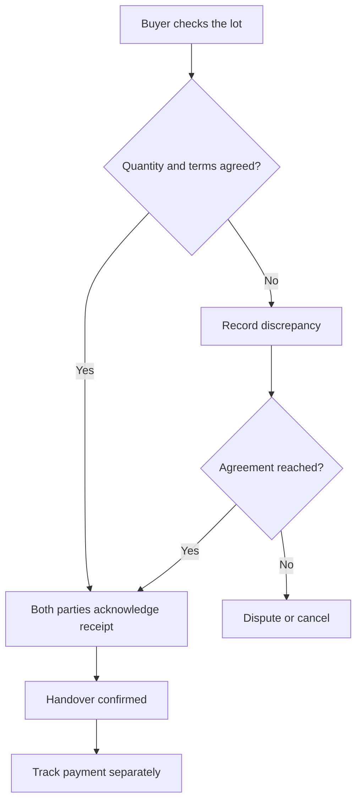

# Collector workflow

[Project overview](../README.md) · [Architecture](system-architecture.md) · [Validation plan](validation-plan.md)

This document describes intended behaviour. The first prototype should make one sale understandable from lot creation to payment, including the cases where a sale does not complete.

## 1. Record what is available

The collector adds a photograph, confirms the category and condition, and enters an approximate quantity with its unit. “Not sure” is a valid category response; a reviewer or buyer can request clarification. A local draft can be saved without internet.

The interface shows a clear sync status. A saved local draft is not yet visible to buyers. Photos help describe the lot; they do not certify its condition, composition or weight.

## 2. Compare suitable offers

Only buyers with checked records and a compatible material scope appear in the formal recycling route. Each offer shows its rate and unit, estimated payable amount, expiry, minimum quantity, transport arrangement, deductions and expected payment time.

**Illustrative comparison — invented figures, not market prices:**

| Same 10 kg demonstration lot | Offer A | Offer B |
| --- | ---: | ---: |
| Rate | ₹80/kg | ₹90/kg |
| Gross amount | ₹800 | ₹900 |
| Collector's stated transport cost | ₹50 | ₹200 |
| Expected proceeds after that cost | ₹750 | ₹700 |

The comparison needs the whole transaction. Final proceeds depend on the accepted quantity and agreed costs. If transport cost is unknown, the interface must show it as unknown rather than zero.

If there are no suitable offers, the lot stays open and explains why: unsupported material, location, lot size or no current buyer response. The app cannot promise a sale or immediate cash.

## 3. Agree on the handover

The selected offer is rechecked online for expiry and availability. The participants agree on who arranges transport, where and when the lot is received, and when payment is due. The agreed offer version remains attached to the transaction.

Contact and pickup details are shared with the parties needed for that handover. The first pilot uses participant-arranged logistics; a delivery fleet and automatic route planning are outside the initial scope.

## 4. Check the actual quantity and terms

At receipt, record the measured quantity, accepted material and any rejected portion. Both sides review the final amount before confirming. A changed rate, deduction or grade requires fresh agreement.

A shared handover reference identifies the transaction. A reference, photo or location alone does not verify it. If one party has not acknowledged receipt, show “Awaiting confirmation”. Offline notes stay provisional until sync and the required acknowledgements are received.

## 5. Record what was actually paid

The buyer can record a cash or digital payment claim. The collector confirms the amount received. Record part-payments, the remaining balance and any dispute separately from material receipt. Payment status can therefore remain pending after a successful handover.

The first prototype records payments; it does not hold funds or guarantee settlement. Any later payment-provider integration needs its own verification and reconciliation design.

## Cases the prototype must handle

| Situation | Expected behaviour |
| --- | --- |
| Offer expires before acceptance | Refresh or request a new quote; preserve the old offer in history. |
| Material or weight differs | Show the proposed correction and recalculate terms for both parties to review. |
| Buyer accepts only part of a lot | Record the accepted portion and keep the unaccepted balance identifiable. |
| Upload is retried | Reuse the event identifier so one action does not create two lots or receipts. |
| Payment is disputed | Retain both claims and supporting records; do not mark the balance paid automatically. |
| No internet during handover | Save a provisional local record; explain what remains unconfirmed. |
| Sale is cancelled | Retain the reason and history; release any reservation on the unsold quantity. |

## Later routes

An aggregator can combine lots only while preserving source quantities and each collector's allocation. A transfer to an aggregator is not counted as a delivery to an authorised recycler. When material reaches a recycler, count it once and retain the upstream links.

Reusable equipment may take a checked repair/refurbishment route, subject to the recipient's role and applicable requirements. Report reuse referrals separately; do not label them as recycling. Waste batteries follow their own route described in the [data plan](data-plan.md).
