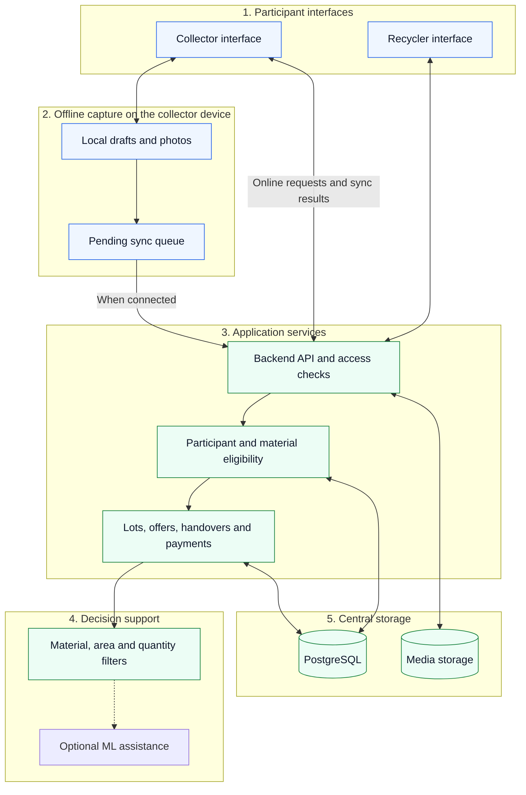

# System architecture

[Project overview](../README.md) · [Collector workflow](collector-workflow.md) · [Data plan](data-plan.md)

This is the proposed design for the first prototype. The diagram separates five responsibilities; it does not imply five separately deployed services. A single backend with clear modules is sufficient for the initial pilot.

## Components and data flow

Solid arrows show the main path. The dotted connection is a later ML extension. Aggregator and repair/refurbishment interfaces will use the same access-controlled backend when those workflows are introduced.

## Responsibility boundaries

| Component | Responsibility |
| --- | --- |
| Collector interface | Photo capture, manual category confirmation, offer review and access to the collector's own receipts. |
| Recycler interface | Publish offers, declare accepted materials and quantities, acknowledge receipt and record payment claims. |
| Local storage and queue | Save drafts and photos, show pending status and retry uploads without creating duplicate lots. |
| Backend | Enforce ownership, roles, offer expiry, transaction transitions and validation. Client-side labels alone cannot authorise a change. |
| Participant review | Keep the registration source, reviewer, check date, facility identity and material scope. Unchecked or suspended buyers cannot receive new matched transactions. |
| Decision support | Filter eligible buyers first, then compare relevant offers. Registration is checked against records, never predicted by a model. |
| PostgreSQL | Store participants, lot references, offer versions, accepted terms, acknowledgements, payment events and change history. |
| Media storage | Store lot photos and guidance assets separately, with access tied to the relevant account and transaction. |

PostgreSQL is the planned central database. The client framework, local database, hosting provider and media service remain implementation choices. No deployed integrations are claimed.

## Offline behaviour

Offline support is for capture and access to previously downloaded records. Publishing a lot, accepting a live offer and confirming a shared transaction require server acknowledgement.

1. Assign each local draft a stable identifier before its first upload.
2. Save edits and photo references locally. Show whether a record is saved on the device, uploading, synced or needs attention.
3. Retry an upload with the same identifier. The server must recognise it as the same operation.
4. Keep a version number for shared records. If the server has newer terms, show the conflict for review rather than silently replacing an accepted quantity or price.
5. Record device event time and server receipt time separately. An offline entry does not become a jointly confirmed receipt merely because it has a timestamp.

Cached prices and offers carry their last-updated time. Expired or offline offers cannot be accepted until refreshed. A lost device may lose unsynced drafts; recovery and local-data protection need testing on the chosen client platform.

## Transaction integrity

Lot, handover and payment states are separate. A successful upload does not mark a handover complete; a completed handover does not mark payment received.

Changes to an accepted offer create a new version that the affected parties must acknowledge. Partial acceptance preserves the remaining quantity. Later aggregation must link quantities back to source lots and prevent reuse of already allocated material.

Corrections retain who changed what, when and why. A dispute stays visible until resolved. The [workflow](collector-workflow.md) defines these cases in terms of collector actions.

## Data access and ML boundaries

Participants can access only their own records and the information required for their transactions. Contact details and precise pickup locations are shared only with the relevant participants. Transport encryption, protected media access, controlled reviewer access and a backup/restore check are requirements to verify before a real pilot.

The three planned ML functions are classification, price estimation/prediction and recycler matching. Low-confidence classification falls back to manual confirmation. Sparse price data produces an explicit lack-of-data message. Matching always respects buyer eligibility, whether it uses filters or a trained ranking model.

Hindi/Marathi text, icons and recorded guidance do not require speech recognition or voice translation. Those are outside the current ML scope.
