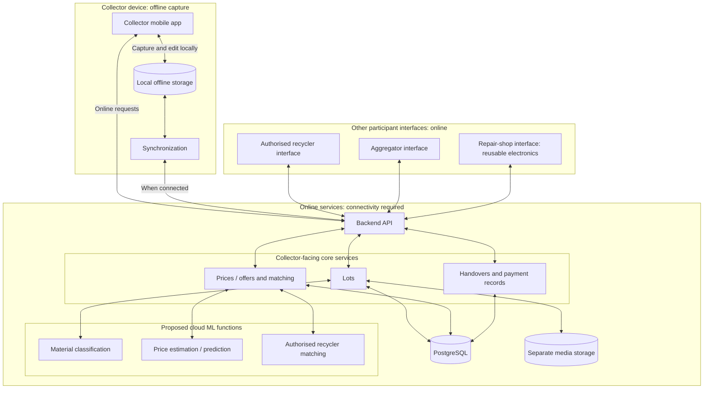

# Proposed System Architecture

This conceptual architecture describes planned components for E-CHAKRA. It does not represent an implemented application or select frameworks, hosting providers or an offline database technology.

## How the components work together

- **Offline capture:** the collector app would save photographs, a manually confirmed category and approximate weight on the device without contacting the backend. Local storage includes a separate database for records and local media files. Synchronization would queue pending changes and transfer them when connectivity returns, with retry and duplicate/conflict handling to be designed.
- **Connected services:** the backend API would coordinate lots, price history and buyer offers, matching, handovers and payment records. Live offers and cloud ML results require connectivity. Any previously downloaded price or offer information shown offline should carry its timestamp and be labelled as potentially outdated.
- **Central storage:** PostgreSQL would hold structured records and media references. Separate media storage would hold uploaded lot photographs and guidance assets. The offline database technology and media-storage provider remain unselected.
- **ML assistance:** the three proposed functions would suggest material categories, estimate/predict prices and recommend suitable authorised recyclers. Collectors would confirm categories; estimates would remain distinct from offers and agreed sale amounts. Authorisation checks would be a participation requirement, not an ML prediction. No ML-based speech recognition, voice translation or additional AI functions are proposed.
- **Participant records:** recyclers would submit offers and acknowledge receipt through the backend. Aggregators would combine lots while preserving source-lot links and each collector's quantity and payment records. Repair shops would participate in the reuse route for suitable electronics.
- **Traceability:** handover references would link the source lots, recipient, confirmed quantities and acknowledgements. Payment records would separately capture cash or optional digital payments and their confirmation status. A recorded agreement or handover would not automatically mark a payment as confirmed.

Related documents: [Project overview](../README.md) · [Data plan](data-plan.md).
